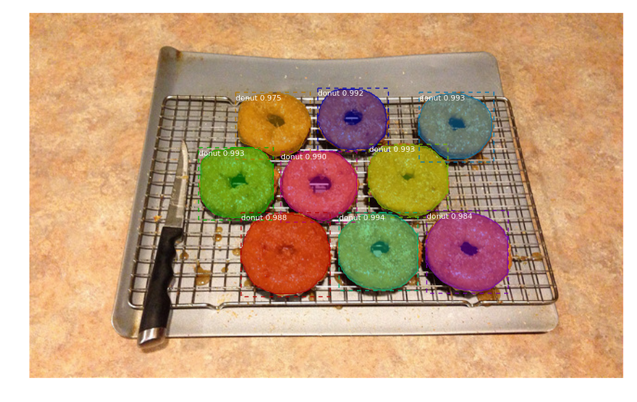

**This is a pre-release. Don't share yet! We're still cleaning it and will likely make breaking changes.**


# Mask R-CNN for Object Detection and Segmentation

This is an implementation of [Mask R-CNN](https://arxiv.org/abs/1703.06870) for object detection and instance segmentation using Keras and TensorFlow. The model generates both, bounding boxes and segmentation masks for each instance of an object in the image.


The repository includes:
* Source code of the Mask R-CNN model, including training and inference functions
* Pre-trained weights on MS-COCO
* Jupyter Notebook tutorial on extending the model to train on your own dataset
* Visualiztion and debugging code for every step of the network

We welcome contributions to improve and extend the model.

## Requirements
* Python 3.4+
* TensorFlow 1.3+
* Keras 2.0.8+
* Jupyter Notebook
* Numpy, skimage, scipy (todo: what else?)

If you use Docker, the model has verified to work on 
[this Docker container](https://hub.docker.com/r/waleedka/modern-deep-learning/).

## Installation
1. Clone this repository
2. Download pre-trained COCO weights from (TODO)

## Running the Demo
The easiest way to use the pre-trained model on your own images is described in the 
[Demo Notebook](/demo.ipynb).
It includes code to run object detection and instance segmentation on arbitrary images.

# What's in the Box
### [inspect_data.ipynb](/inspect_data.ipynb)
This is an in depth notebook with visualizations of the different pre-processing steps
performed to prepare the training data.

### [inspect_model.ipynb](/inspect_model.ipynb)
This notebook show visualizations of every step of the pipeline that an image
goes through from start to the final object masks and bounding boxes.
It's great for debugging or creating visualiztions of various steps of the process.

### [inspect_weights.ipynb](/inspect_weights.ipynb)
This notebooks inspects the weights of a trained model and looks for anomilies or odd patterns.

# Project Structure
The project is divided into groups:

### Mask RCNN implementation
The main model implementation is in the `model.py` and `common.py` files. 
This includes the Keras model, custom layers, data loading and processing.

### Dataset-Specific Code
To make it easy to customize the model to your needs, we separated the
dataset-specific code into their own modules. Currently we have two 
datasets supported out of the box.
* Shapes: a synthetic toy dataset for experimentation in `shapes.py`.
* MS COCO: The official COCO dataset support is in `coco.py`.

These models also contain the configurations and training code for their 
corresponding datasets.

### Visualizations
Most of the core visualization functions are in ```visualize.py``` and the
visualiztions are used in several Jupyter notebooks. Especially, 
[inspect_model.ipynb](/inspect_model.ipynb) and [inspect_data.ipynb](/inspect_data.ipynb)
use a lot of visualizations.


# Training on Your Own Dataset
To train the model on your own dataset you'll need to sub-class two classes:

```Config```
The `Config` class contains the default configuration. Subclass it and modify the attributes you need to change.

```Dataset```
The `Dataset` class provides a consistent way to work with any dataset. 
It allows you to use new datasets for training without having to change 
the code of the model. It also supports loading multiple datasets at the
same time, which is useful if the objects you want to detect are not 
all available in one dataset. 

The ```Dataset``` class itself is the base class. To use it, create a new
class that inherts from it and adds functions specific to your dataset.
Most often, you just need to add one function `load_<your dataset name>()`

TODO: for example

To use multiple data sources, you can easily chain your classes as such:
```
class COCODataset(Dataset):
   ...
   
class VOCDataset(COCODataset):  # <-- inheritis from COCODataset
   ...
   
my_dataset = VOCDataset()  # Supports loading both COCO and VOC.
```


## Visualizations
TODO


